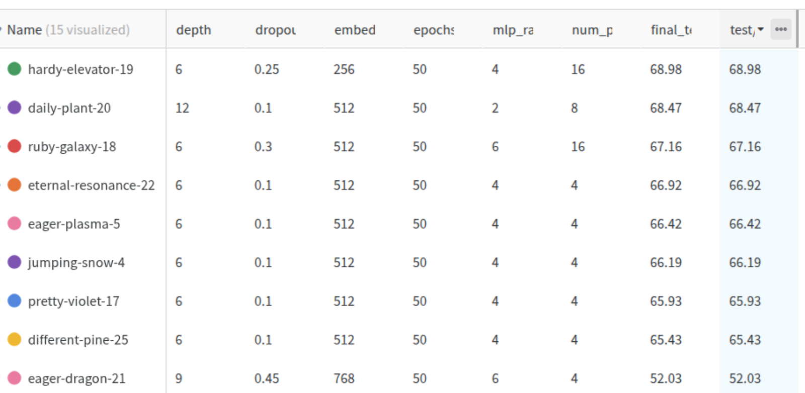

# Patch Size Variation

We tried varying hyperparameters across multiple different variables. Here is a table of multiple runs. 



We realised that the better models were obtained be means of smaller parameters. That, combined with **data augmentation**, yielded better results. 

## best config

The best model configuration turned out to be the following. 

```
cfg = {
    # Architecture
    'depth': 6,
    'dropout': 0.1,          
    'mlp_ratio': 4,
    'num_patches': 8,        
    'embed_dim': 192,        

    # Optimization
    'lr': 1e-3,              
    'weight_decay': 0.05,    
}
```

combined with basic data augmentation:

```
train_transform = transforms.Compose([
    transforms.RandomCrop(32, padding=4, padding_mode='reflect'),
    transforms.RandomHorizontalFlip(),
    transforms.RandomApply([  # 50% chance to apply each
        transforms.ColorJitter(brightness=0.1, contrast=0.1, saturation=0.1, hue=0.02),
    ], p=0.5),
    transforms.RandomApply([
        transforms.GaussianBlur(kernel_size=3, sigma=(0.1, 0.5)),
    ], p=0.3),
    transforms.ToTensor(),
    transforms.Normalize(CIFAR_MEAN, CIFAR_STD),
    transforms.RandomErasing(p=0.2, scale=(0.02, 0.1)),  # Very mild erasing
])
```

performed the best. These are basic augmentations applied randomly to the dataset. Visualisations of the imagesin the augmented dataset are attached:


More agressive augmentation did not work any better. 

# Embeddings 


We see that 2d and sinusoidal embeddings provide marginal improvements over 1d learned embeddings. None, is, however, significantly worse than the others. 


# Attention Maps
Visualisation attached:


